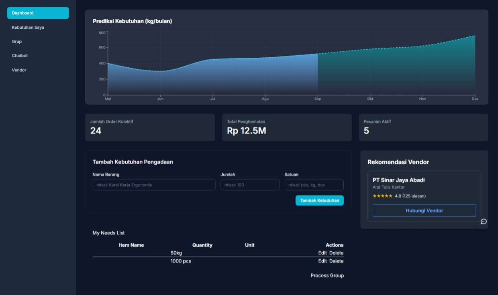
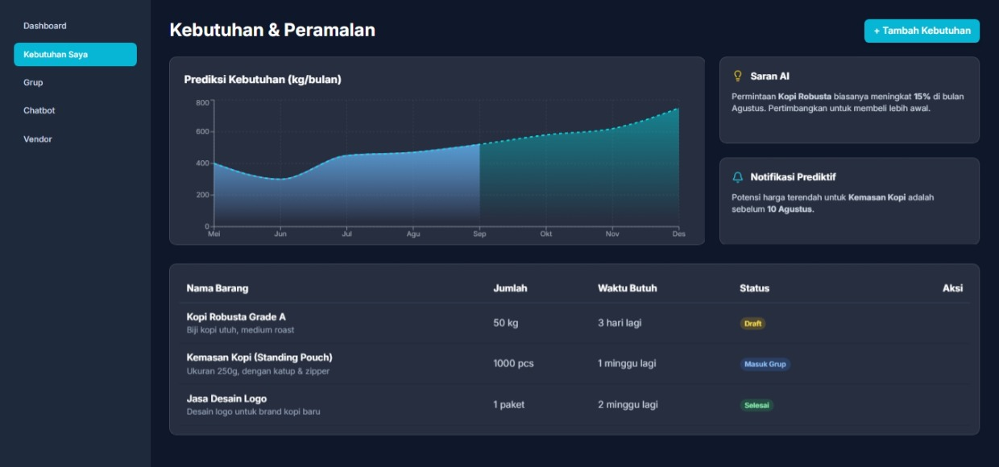
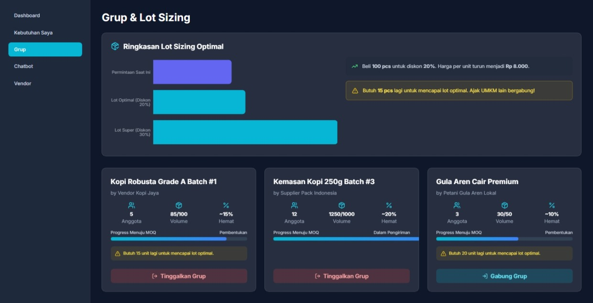
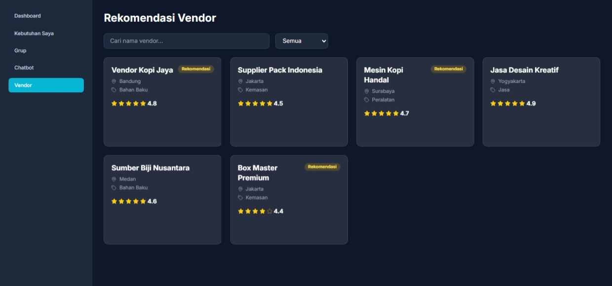
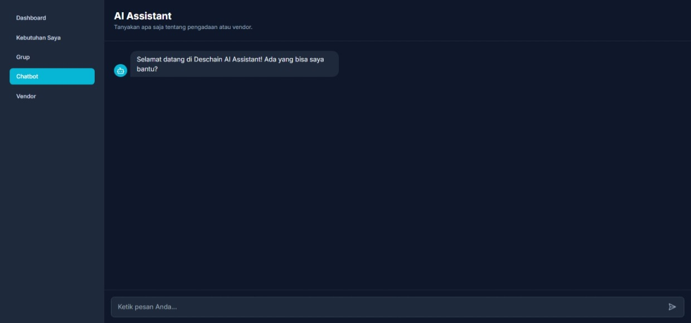

# Deschain
### Platform Pengadaan Kolektif Berbasis AI untuk UMKM dan Koperasi Indonesia

Deschain adalah platform SaaS pengadaan kolektif berbasis AI yang memungkinkan
UMKM dan koperasi Indonesia untuk:

- Menggabungkan kebutuhan pembelian bahan baku secara kolektif
- Membentuk grup pembelian otomatis berbasis algoritma Dynamic Programming
- Memilih vendor terbaik secara data-driven dengan Hybrid Collaborative Filtering
- Membangun credit trail digital sebagai fondasi akses pembiayaan formal

**Masalah yang diselesaikan:** Dari 65,5 juta UMKM Indonesia, lebih dari 75%
membeli bahan baku secara individual dan tidak bisa memenuhi minimum order
quantity untuk harga grosir. Akibatnya mereka membayar 15-25% lebih mahal
dari yang seharusnya. Di sisi lain, 44 juta UMKM tidak bisa akses pembiayaan
formal karena tidak punya rekam jejak transaksi digital.

Deschain memotong dua inefisiensi ini sekaligus.

---

## Screenshot Platform

| Dashboard | Kebutuhan & Peramalan |
|---|---|
|  |  |

| Grup & Lot Sizing | Rekomendasi Vendor |
|---|---|
|  |  |

| AI Assistant |
|---|
|  |

---

## Algoritma Inti (POC Aktif)

### 1. Group Matching — Dynamic Programming
**File:** `Grub_Pengadaan.ipynb`

Mengelompokkan UMKM berdasarkan kesamaan kebutuhan, lokasi geografis,
kuantitas, dan timeline pengadaan untuk memaksimalkan penghematan kolektif.
```
State    : (jenis_barang, kuantitas, lokasi, timeline, budget)
Objective: Maksimalkan penghematan kolektif
Constraint: Memenuhi minimum order quantity vendor
Output   : Batch/grup optimal dengan total biaya minimum
```

**Hasil POC:** Dengan data 200 UMKM dan 10 vendor, algoritma membentuk
grup pembelian optimal dengan total biaya minimum Rp 132.710.474,75 dan
diskon kolektif hingga 15%.

### 2. Forecasting & Lot Sizing — Time Series + Optimasi
**File:** `Forcasting_&_lot_sizing.ipynb`

Auto-selector dari 8 model forecasting, pilih yang terbaik berdasarkan MAPE.
7 metode lot sizing tersedia untuk kalkulasi kuantitas pembelian optimal.

**Model Forecasting:**
- Simple Moving Average (SMA)
- Weighted Moving Average (WMA)
- Single Exponential Smoothing (SES)
- Double Exponential Smoothing (DES)
- Holt-Winters
- ARIMA
- Prophet
- LSTM

**Metode Lot Sizing:**
- Economic Order Quantity (EOQ)
- Wagner-Whitin (Dynamic Programming)
- Silver-Meal Heuristic
- Least Unit Cost
- P-system / Q-system
- Time-Based Replenishment

---

## Fitur Platform

**AI Group Matching**
Algoritma dynamic programming yang secara otomatis mencocokkan kebutuhan
UMKM dengan pengguna lain dan membentuk grup pembelian kolektif optimal.

**Smart Vendor Recommendation**
Sistem hybrid collaborative filtering yang merekomendasikan vendor terbaik
berdasarkan performa historis, rating komunitas, harga, dan lokasi.

**AI Procurement Assistant**
Chatbot berbasis LLM dalam bahasa Indonesia yang menjawab pertanyaan
pengadaan menggunakan data harga pasar real-time.

**Credit Trail Dashboard**
Pencatatan otomatis setiap transaksi sebagai rekam jejak digital yang dapat
digunakan UMKM sebagai dokumen pendukung akses pembiayaan formal, selaras
dengan arah kebijakan Innovative Credit Scoring OJK 2025.

---

## Tech Stack

| Layer | Teknologi |
|---|---|
| Frontend | Next.js 14, TypeScript, Tailwind CSS |
| Backend | Python, FastAPI |
| Database | MySQL (via XAMPP) |
| AI / ML | scikit-learn, statsmodels, Hugging Face |
| AI Chat | Mistral-7B via Hugging Face Inference API |
| Auth | JWT |

---

## Struktur Repository
```
Deschain-app/
├── Poc/                            # Prototype platform
│   ├── app/                        # Next.js App Router
│   │   ├── dashboard/              # Halaman utama
│   │   │   ├── page.tsx            # Dashboard ringkasan
│   │   │   ├── needs/              # Kebutuhan & Peramalan
│   │   │   ├── groups/             # Grup & Lot Sizing
│   │   │   ├── vendors/            # Rekomendasi Vendor
│   │   │   └── chatbot/            # AI Assistant
│   │   ├── components/             # Komponen UI
│   │   │   ├── Sidebar.tsx
│   │   │   ├── InputForm.tsx
│   │   │   ├── VendorList.tsx
│   │   │   ├── ChatInterface.tsx
│   │   │   ├── GroupList.tsx
│   │   │   ├── LotSizingSummary.tsx
│   │   │   ├── ForecastChart.tsx
│   │   │   └── StatusCard.tsx
│   │   ├── globals.css
│   │   ├── layout.tsx
│   │   └── page.tsx
│   ├── package.json
│   ├── tailwind.config.ts
│   └── next.config.mjs
├── Grub_Pengadaan.ipynb            # POC algoritma group matching
├── Forcasting_&_lot_sizing.ipynb   # POC forecasting & lot sizing
└── README.md
```

---

## Cara Menjalankan

### Prerequisites
- Node.js 18 atau lebih baru
- Python 3.9 atau lebih baru
- XAMPP (MySQL)

### Jalankan Frontend
```bash
cd Poc
npm install
npm run dev
```

Buka http://localhost:3000

### Jalankan Notebook POC
```bash
pip install jupyter pandas numpy scikit-learn matplotlib seaborn statsmodels

jupyter notebook
```

Buka salah satu:
- `Grub_Pengadaan.ipynb` untuk algoritma group matching
- `Forcasting_&_lot_sizing.ipynb` untuk forecasting dan lot sizing

---

## Roadmap

**Fase 1 — POC Fungsional (April - Juni 2026)**
- Alur end-to-end dengan data nyata
- 20-30 UMKM pilot di Pontianak, Kalimantan Barat
- 20 vendor lokal di-onboard
- AI assistant terhubung ke Hugging Face API
- Backend FastAPI + MySQL

**Fase 2 — MVP (Juli - September 2026)**
- Collaborative filtering dengan data transaksi riil
- Alur pembelian kolektif end-to-end
- 100 UMKM aktif, 100 vendor terverifikasi
- Credit trail dashboard aktif

**Fase 3 — Ekspansi Regional (Oktober 2026 - Maret 2027)**
- Ekspansi ke Kalimantan Selatan, Jawa Tengah, Sulawesi Selatan
- 1.000 UMKM aktif, 200 vendor terverifikasi
- Integrasi lembaga keuangan mitra untuk credit trail

---

## Dampak yang Ditargetkan

| Metrik | Target 1 Tahun | Target 3 Tahun |
|---|---|---|
| UMKM aktif | 1.000 | 50.000 |
| Penghematan biaya rata-rata | 15% | 20-25% |
| Vendor terverifikasi | 50 | 500+ |
| UMKM dengan credit trail | 500 | 25.000 |

---

## Tim

**Abdullah Khalid Fadillah**
Product Architect dan AI System
Rekayasa Sistem Komputer, Universitas Tanjungpura
h1051221107@student.untan.ac.id

**Duta Satria Nugroho**
Web Developer dan Frontend
Rekayasa Sistem Komputer, Universitas Tanjungpura

---

## Penghargaan

Penerima Penghargaan Kategori Mahasiswa, Innovation Frontier 1
BI-OJK Hackathon 2025 — Bank Indonesia dan Otoritas Jasa Keuangan

---

## Referensi

- OJK Institute. (2025). UMKM Mendunia. institute.ojk.go.id
- Pusat Investasi Pemerintah, Kemenkeu RI. (2024). pip.kemenkeu.go.id
- Bank Indonesia. (2025). QRIS Jelajah Indonesia. bi.go.id
- Bank Indonesia. (2022). Blueprint Sistem Pembayaran Indonesia 2030.
- Kadin Indonesia. (2024). Supply Chain Management UMKM. kadin.id

---

## Lisensi

MIT License — lihat file LICENSE untuk detail.

---

*Deschain — Gabungkan Kebutuhan, Perbesar Daya Tawar, Buka Akses.*
